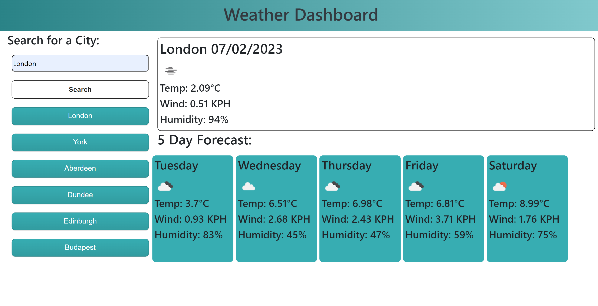

# Weather-Dashboard

This [Weather-Dashboard webpage](https://amikerb.github.io/Weather-Dashboard/) allows the user to find the current weather and the next five days weather forecast for any choosen city. The webpage is created using the Open Weather API. The users previously searched cities are displayed as buttons underneath the search box and allow the user to quickley access the weather forecast for these cities. 

## Screenshot

## Credits 

- [starter code](https://git.bootcampcontent.com/uk-edx-16-week/UK-VIRT-FE-PT-12-2022-U-LOLC/-/tree/main/08-server-apis-module/04-weather-dashboard-lesson/challenge) was provided 
- [openWeather API](https://openweathermap.org/forecast5)
- stackoverflow to [How do I calculate the temperature in celsius returned in openweathermap.org JSON?](https://stackoverflow.com/questions/19477324/how-do-i-calculate-the-temperature-in-celsius-returned-in-openweathermap-org-jso)
- [Array.prototype.includes()](https://developer.mozilla.org/en-US/docs/Web/JavaScript/Reference/Global_Objects/Array/includes) on mdn web docs
- [How can I show the weather icon from open weather map](https://stackoverflow.com/questions/61954091/flutter-how-can-i-show-the-weather-icon-from-open-weather-map#:~:text=response%20%3D%20await%20http.-,get(%20'https%3A%2F%2Fapi.openweathermap.org%2Fdata,temp'%5D%3B%20temp%20%3D%20temp)
- [Remove duplicate values from JS array [duplicate]](https://stackoverflow.com/questions/9229645/remove-duplicate-values-from-js-array)
- history button design by [Gumroad Button 25](https://getcssscan.com/css-buttons-examples) on CSS Scan
- search button design by [Airbnb Button 23](https://getcssscan.com/css-buttons-examples) on CSS Scan

